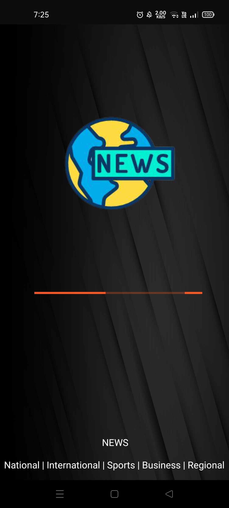
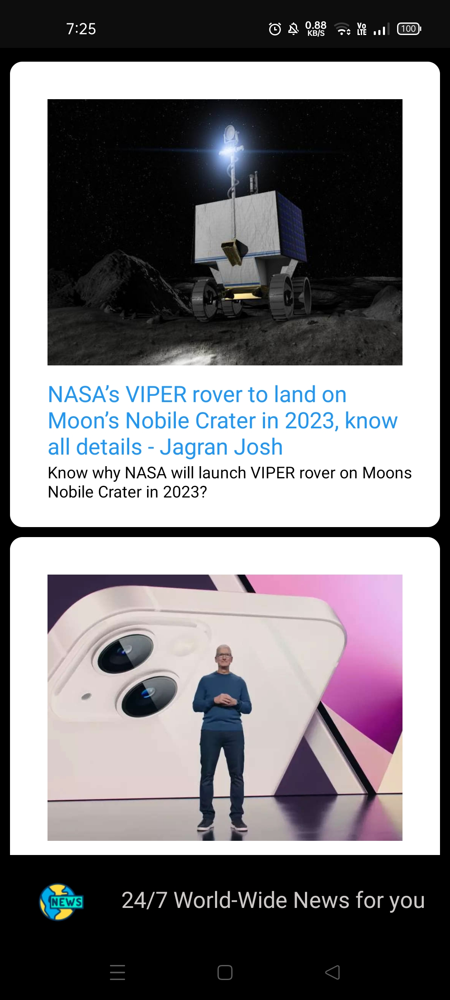

# NewsApp

A News App using Public API which displays News in CardView. 

The App is created as a part of Developer Days 5-week long event. 
**Week** - #3 Challenge 
Android Development using . 

## Things learnt: 
-Making a simple API call. 
-Displaying Info. in Card View. 

## Screenshots

  
  
 

## Demo Video

